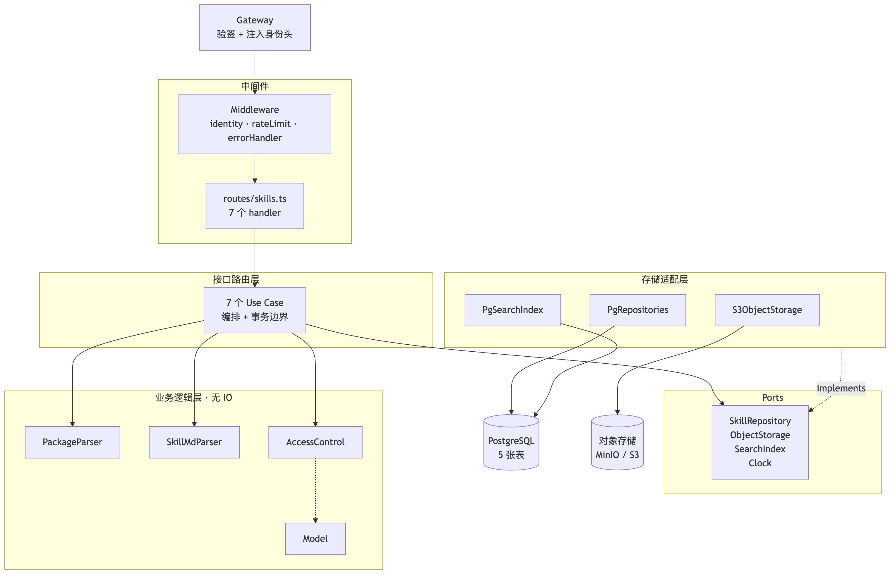
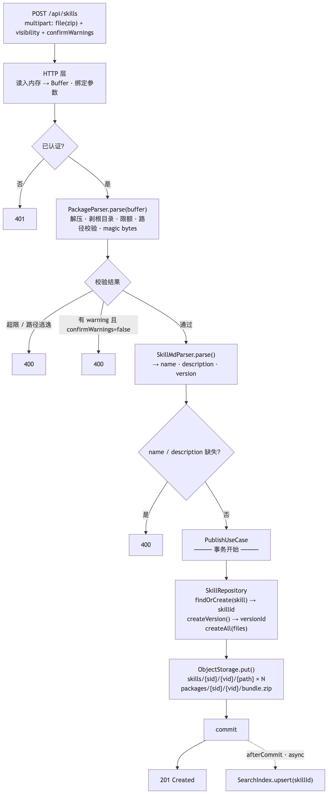
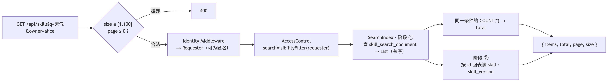
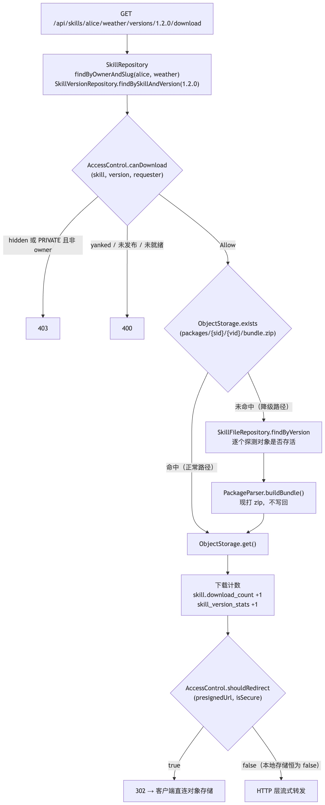

# 基本约定

- 数据库只存 storage_key，不存文件字节。
    
- 单进程单体。 一个 Hono 进程包含全部功能，无独立 worker、无消息队列。索引重建在同进程的事件循环里异步执行。
    
- 分层，依赖单向向内。
    

```SQL
HTTP 层 ──▶ 路由 ──▶ 逻辑层
                  │                 
                  ▼                 
            接口（interface）
                  ▲
                  │ implements
            实现 层 ──▶ PostgreSQL · 对象存储
```

# 整体架构



# 上传流程



# 搜索流程


# 下载流程

