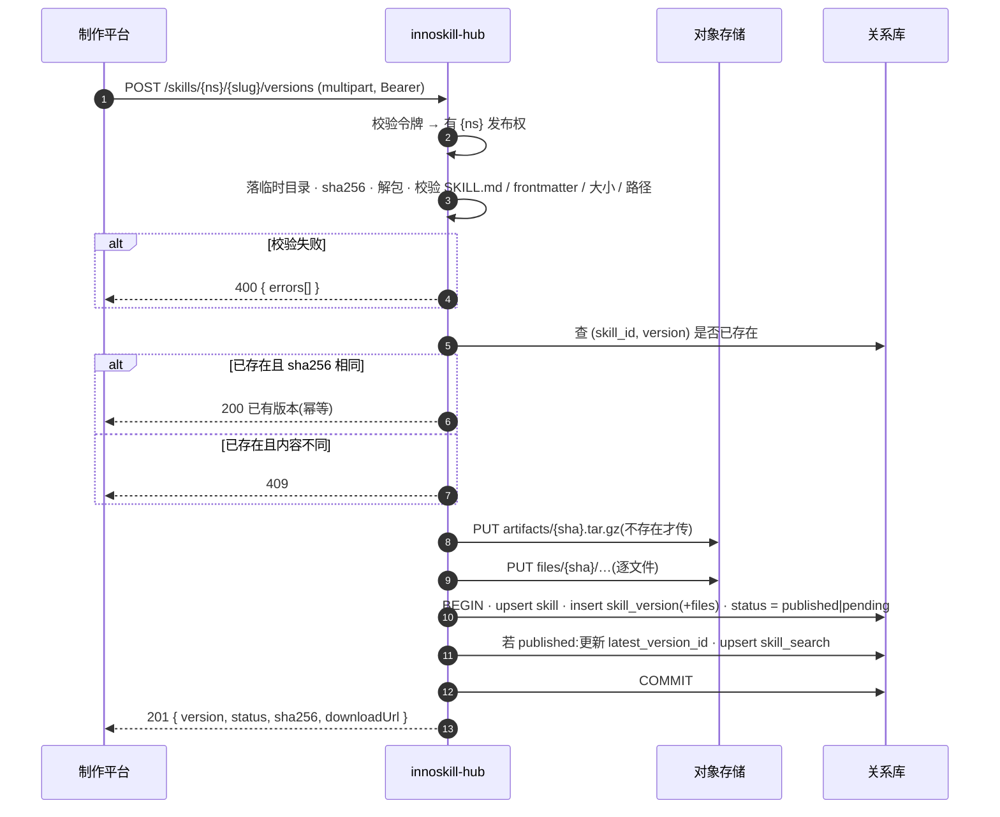
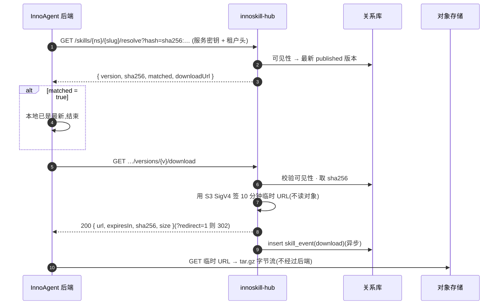
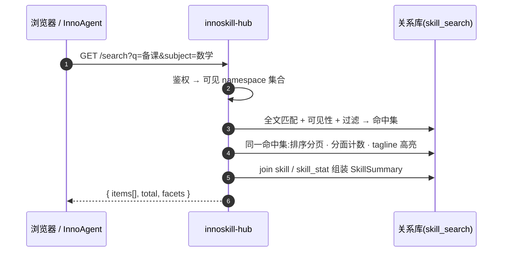

# innoskill-hub 后端设计 v1.1(架构 · 存储 · 表结构 · 搜索 · 时序)

> 2026-09-15 定稿待评审,配合 `05-HTTP接口设计.md`。应用层技术栈待定(BFF 式薄服务,Next.js Route Handlers 或任何薄框架都能承接);基础设施已定:**PostgreSQL + 阿里云 OSS(S3 兼容 API)**。⚠️ = 待领导拍板,见第 7 节。

---

## 0. 定位与已确认决策

innoskill-hub 后端是一层**薄服务(BFF 式)**:鉴权、校验、编排,不做重计算。重活交给两样基础设施,后端直连:

| 基础设施 | 放什么 | 为什么 |
|---|---|---|
| PostgreSQL | 元数据:namespace / skill / version / 文件清单 / 台账 / 统计;**全文索引也在这**(`skill_search` 表) | 事务、唯一约束、多条件筛选;w 级技能用 PG 全文绰绰有余,不引搜索引擎 |
| 阿里云 OSS | 原始数据:tar.gz 包 + 解包后的文件 | 大、只读;**走 S3 兼容 API**(`@aws-sdk/client-s3` 或 minio 客户端指向 OSS endpoint),不用阿里 SDK,换云只改 endpoint |

已确认(2026-09-15):

| 项 | 结论 | 对设计的影响 |
|---|---|---|
| 上游 | 后端直连 PG 与 OSS,没有中间平台服务 | 架构两层,没有内部 RPC |
| 租户 | 只在登录注册出现,本服务不管 | `namespace` 只是隔离键,不建成员 / 策略;首次发布自动创建 |
| 规模 | 用户 k 级、技能 w 级 | 单实例 + PG 全文即可;不做分库、不做队列 |
| 下载 | 给前端临时 OSS 地址 | 包本体不经过后端,后端只签 URL |
| 源文件 | 制作平台自己保留 | 本服务是发布副本,备份要求降为"每日快照 + OSS 默认冗余"

---

## 1. 架构图

```mermaid
flowchart LR
  subgraph callers[调用方]
    MK[技能制作平台<br/>Bearer 发布令牌]
    IA[InnoAgent 后端<br/>服务密钥 + 租户头]
    WEB[独立站 / 浏览器<br/>匿名]
  end

  subgraph hub[innoskill-hub 后端]
    direction TB
    AUTH[鉴权与可见性<br/>算出「本次请求能看哪些 namespace」]
    PUB[发布<br/>解包 · 校验 · 入库]
    CAT[目录查询<br/>列表 · 详情 · 版本 · resolve]
    SRCH[搜索<br/>查询构造 · 分面 · 高亮]
    ART[制品<br/>下载 · 文件读取 · ETag]
    INST[安装台账 · 统计]
    JOBS[后台任务<br/>GitHub 导入器 · 统计聚合 · 孤儿清理]
  end

  subgraph infra[基础设施(直连)]
    DB[(PostgreSQL<br/>元数据 + 全文索引)]
    OBJ[(阿里云 OSS<br/>S3 兼容 API<br/>artifacts/ files/)]
  end

  MK -->|POST versions| AUTH
  IA -->|download · installs| AUTH
  WEB -->|skills · search| AUTH
  AUTH --> PUB & CAT & SRCH & ART & INST
  PUB --> OBJ & DB
  CAT --> DB
  SRCH --> DB
  ART --> DB
  ART -->|只签临时 URL,不转发字节| OBJ
  INST --> DB
  JOBS --> DB & OBJ
  IA -.->|凭临时 URL 直接下载| OBJ
  WEB -.->|凭临时 URL 直接下载| OBJ
```

规则一句话:**所有读接口先经「鉴权与可见性」算出可见 namespace 集合,再下推到 SQL / 搜索的 where 条件**,不在业务代码里散落判断。

---

## 2. 存储设计

### 2.1 元数据 vs 原始数据

| 数据 | 存哪 | 键 |
|---|---|---|
| 技能坐标、版本、状态、frontmatter、文件清单、统计、台账 | 关系库 | 见第 3 节 |
| 版本包 tar.gz | OSS `artifacts/{sha[0:2]}/{sha[2:4]}/{sha256}.tar.gz`,私有读 | **内容寻址**:同内容只存一份,版本表只记 sha256;下载时后端签 10 分钟临时 URL |
| 解包后的文件(在线预览、demo 图) | OSS `files/{sha256}/{path}`,私有读 | 发布时同步解包写入;文本类后端读出返回,图片签临时 URL |
| SKILL.md 正文 | 关系库 `skill_version.body` | 搜索和详情页都要,单独存一份省得回对象存储 |

frontmatter 整体存 JSONB;`category / subject / kind / scenario / tagline / description` 再提成列建索引,查询不碰 JSON。

### 2.2 写入顺序与一致性

1. 上传流先落**临时目录**,算 sha256,解包,校验
2. 写对象存储:`artifacts/…`(已存在就跳过)+ `files/…`
3. **一个数据库事务**:插 `skill_version` + `skill_file`,必要时建 `skill`、更新 `latest_version_id`、刷新 `skill_search`
4. 事务提交后对外可见;之前任何一步失败,清临时目录,对象存储可能留下孤儿 → 后台任务按天清理"无版本引用且创建超过 24 h"的对象

对象先于元数据写、事务最后提交,保证**可见即可下**。

### 2.3 容量、限制与备份

单包 ≤ 30 MB、单文件 ≤ 5 MB、≤ 300 文件 ⚠️。w 级技能 × 平均 200 KB ≈ 几 GB,OSS 标准存储即可。制作平台保留源文件,本服务是发布副本:OSS 用默认冗余,PG 每日快照,不开跨区备份。tar.gz 是唯一"必须不丢"的数据,其余(文件、索引、统计)都能从它重建。

**OSS 访问方式**:S3 兼容 API(endpoint `oss-cn-xxx.aliyuncs.com`,path-style 关、virtual-host 开),客户端 `@aws-sdk/client-s3` 或 `minio`;预签名 URL 用标准 SigV4。换到腾讯 COS / MinIO 只改 endpoint 与密钥。

---

## 3. 表结构

完整 DDL 在 [`schema.sql`](./schema.sql)(PostgreSQL,13 张表)。所有业务表带 `namespace_id` 作隔离键。

| 表 | 一行是什么 | 关键约束 |
|---|---|---|
| `namespace` | 一个租户 / 官方库 | `name` 唯一;首次发布自动创建,无成员、无策略 |
| `skill` | 一个坐标 `namespace/slug` | `(namespace_id, slug)` 唯一;`visibility`;`latest_version_id` |
| `skill_version` | 一次发布 | `(skill_id, version)` 唯一;`status` 一期只用 `published / yanked`;`sha256`;frontmatter JSONB + 提列的 `category / subject / kind / scenario`;`body` 正文 |
| `skill_file` | 版本内一个文件 | `(version_id, path)` 主键;`sha256`、`mime` |
| `skill_tag` | 自定义标签 → 版本 | `latest` 不存,由 `skill.latest_version_id` 派生 |
| `skill_search` | 每个技能一行搜索文档,只反映最新已发布版 | `tsvector` GIN;冗余可见性与分面列,查询不回表 |
| `publish_token` | 一把发布 / 管理令牌 | 只存哈希;`scopes`;可过期、可吊销 |
| `user_install` | 用户 × 技能的安装记录 | `(user_id, skill_id)` 唯一;卸载只填 `uninstalled_at`;记 `version_id` |
| `skill_event` | 下载 / 安装 / 卸载 / 浏览一条流水 | 只追加;统计从这里聚合 |
| `skill_stat` | 每技能统计快照 | 读接口只读这张,后台每分钟重算 |
| `pack` / `pack_skill` | 技能包 / 包内成员与顺序 | `(namespace_id, slug)` 唯一 |
| `import_run` | 一次外部导入 | 来源、commit、状态 |


三条规则:可见性只在 `skill.visibility + namespace_id` 上判断一次;统计只 `insert skill_event`,不在请求里 `+1`;已发布数据不删,只改 `status` / 填 `uninstalled_at`。与现有 SQLite 表的差别:`skill` 拆成 `skill + skill_version`,其余多了 `namespace_id` 与版本引用。

---

## 4. 搜索设计

### 4.1 搜什么

| 字段 | 权重 | 来源 |
|---|---|---|
| `display_name`、`slug` | A | skill |
| `tagline` | B | 最新已发布版 |
| `description`(含触发词) | C | 同上 |
| `body`(SKILL.md 正文) | D | 同上 |

只索引**最新已发布版**;`pending / yanked / private` 不进索引或带可见性列在查询时滤掉。

### 4.2 怎么搜(一期:关系库全文)

- 中文分词:阿里云 RDS PostgreSQL 提供 `zhparser` 与 `pg_jieba` 扩展,用其一建 `doc`;万一环境没有,退到 `pg_trgm` 三元组(现在 SQLite 用的就是 trigram,效果可接受)。英文用默认 `english` 词典,两者拼进同一个 `tsvector`
- 量级:w 级文档的 GIN 索引几十 MB,查询毫秒级,不需要独立搜索引擎
- 查询:`q` → `websearch_to_tsquery`(支持引号短语、`-排除`);< 3 字走前缀匹配
- 排序:`relevance` = `ts_rank_cd(doc, query) * (1 + log(1 + downloads)) * 新近度衰减`;`downloads` / `recent` 直接排
- 过滤:可见性 + `category / subject / kind / namespace` 都是 `skill_search` 上的列,一次 where 搞定
- 分面:同一个过滤后的 CTE 上 `group by category / subject / kind`,返回结果集内计数
- 高亮:`ts_headline` 只对 `tagline` 做,正文不做(贵且没用)

```sql
with hit as (
  select s.skill_id, ts_rank_cd(s.doc, q) as rank
  from skill_search s, websearch_to_tsquery('zh', :q) q
  where s.doc @@ q
    and (s.visibility = 'public' or s.namespace_id = any(:visible_ns))
    and (:category is null or s.category = :category)
)
select … from hit join skill … order by rank * (1 + ln(1 + downloads)) desc limit :size offset :off;
```

### 4.3 索引维护

发布事务里同步重写该技能的 `skill_search` 一行(`upsert`);yank / 审核 / 改可见性同理。不做异步队列:一次发布只影响一行,同步写最不容易漏。

### 4.4 二期换引擎的边界

代码里搜索走一个 `SearchIndex` 接口(`index(skill) / remove(skill) / query(params)`)。要换 Meilisearch / OpenSearch 时只换实现,`skill_search` 表退化为"待同步标记"。按 w 级规模一期不会触发;触发条件:技能 > 50 万、需要拼写容错、需要向量语义搜索(届时优先加 `pgvector` 列,仍不引引擎)。

---

## 5. 时序图

### 5.1 上传发布



### 5.2 下载(含 resolve 与缓存)



### 5.3 搜索



InnoAgent 的「一键添加」全流程见 `03-InnoAgent接入指南.md` 第 5 节,不重复。

---

## 6. 后台任务

| 任务 | 频率 | 做什么 |
|---|---|---|
| 统计聚合 | 每分钟 | `skill_event` → `skill_stat`(downloads 计数、installs 去重用户数、views) |
| 孤儿清理 | 每天 | 对象存储里无 `skill_version.sha256` 引用、且创建 > 24 h 的 `artifacts/` `files/` |
| GitHub 导入器 | 定时 / webhook | 读 hub 仓库,把每个技能作为 `official` namespace 的一个版本走同一条发布流水(内容没变则跳过) |
| 健康检查 | — | `/healthz` 返回库、对象存储连通性与最近导入 |

---

## 7. 待领导拍板

| # | 问题 | 本文假设 |
|---|---|---|
| 1 | 要不要审核 | 一期发布即上架;`status` 字段与 `review` 接口预留,二期打开 |
| 2 | 存量 78 个技能与 GitHub hub 去向 | 一次性导入 `official` 为 `1.0.0`;GitHub 导入器保留为可选后台任务 |
| 3 | 包大小 / 文件数 / 类型限制 | 30 MB / 300 个 / 禁可执行二进制 |
| 4 | 新建 Skill 的默认可见性 | `tenant`(同租户可见,不对外) |

已确认项见第 0 节。应用层技术栈由你们定,本文不依赖具体框架。
