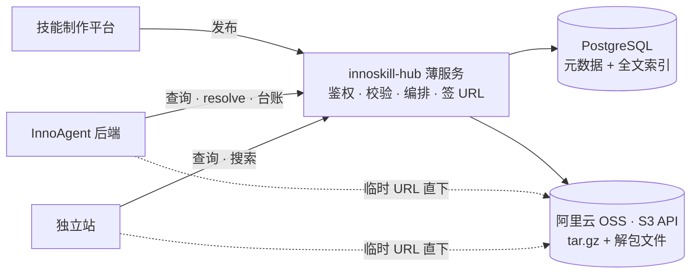

# innoskill-hub 后端设计评审摘要

> 一页纸,给决策用。细节在 `06-后端设计.md`(架构 / 存储 / 表结构 / 搜索 / 时序)与 `05-HTTP接口设计.md`(接口)。2026-09-15。

## 1. 目标

把 innoskill-hub 从"GitHub 仓库的镜像"改成**技能注册中心**:自己存技能、按租户隔离、让技能制作平台直接发布、让 InnoAgent 直接消费。后端是一层薄服务,重活交给 PostgreSQL 和 OSS。

## 2. 范围

| 一期做 | 一期不做 |
|---|---|
| 上传(发布)/ 下载 / 查询 / 搜索四组 HTTP 接口 | 审核流(字段与接口预留,二期开关) |
| 版本不可变、`latest`、resolve、下架(yank) | 用户注册登录、租户管理(登录体系负责) |
| 租户隔离(`namespace` 隔离键)、三档可见性 | CLI、付费、评分评论、爬取 |
| 存量 78 个技能导入官方库;兼容 inno-agent 开源版协议 | 独立搜索引擎、消息队列 |
| InnoAgent 安装台账与统计(已有,改为记版本) | 阿里云专有 SDK |

## 3. 关键决策

已确认:

| 决策 | 结论 |
|---|---|
| 基础设施 | PostgreSQL + 阿里云 OSS,后端直连;OSS 走 **S3 兼容 API**,不绑定阿里 |
| 租户 | 由登录体系给出,本服务只存隔离键,不做租户管理 |
| 发布方式 | 制作平台服务端调用,Bearer 发布令牌;制作平台保留源文件,本服务是发布副本 |
| 下载方式 | 后端只签 10 分钟临时 OSS 地址,包本体不经过后端 |
| 规模 | 用户 k 级、技能 w 级 → 单实例 + PG 全文即可 |
| 应用层栈 | 薄服务(BFF 式),框架待定,设计不依赖框架 |

待拍板:

| # | 问题 | 建议 |
|---|---|---|
| 1 | 要不要审核 | 一期发布即上架,靠"默认仅租户可见 + 可下架"兜底;二期打开审核 |
| 2 | 存量与 GitHub hub | 一次性导入为 `official` 库 1.0.0;GitHub 导入器保留为可选任务 |
| 3 | 包限制 | 30 MB / 300 文件 / 禁可执行二进制 |
| 4 | 新技能默认可见性 | `tenant`(同租户可见,不对外) |

## 4. 架构一图

三条主流程:**发布** = 校验 → 写 OSS → 一个事务写 PG;**下载** = 查可见性 → 签临时 URL;**搜索** = PG 全文 + 可见性过滤 + 分面。

## 5. 数据

- 13 张表,所有业务表带 `namespace_id`;版本不可变,统计走事件流水
- OSS 两个前缀:`artifacts/{sha256}.tar.gz`(内容寻址)、`files/{sha256}/…`(预览)
- 全文索引:每个技能一行 `skill_search`,只反映最新已发布版;中文用 RDS 自带 `zhparser` / `pg_jieba`

## 6. 与现有系统

| 系统 | 关系 |
|---|---|
| GitHub `inno-agent-hub` | 从"唯一真源"降为"导入通道";78 个存量技能导入 `official` |
| inno-agent 开源版 | `/index.json` + `/skills/{slug}.tar.gz` 协议保留,零改动 |
| 线上 InnoAgent | 沿用 `03-InnoAgent接入指南` 的服务密钥与安装台账;技能标识升级为 `namespace/slug/version` |
| 技能制作平台 | 新增消费方,只用发布接口 |
| 现有前端 | 星图 / 列表 / 详情继续用,数据源换成新接口 |

## 7. 风险与对策

| 风险 | 对策 |
|---|---|
| 一期无审核,劣质 / 恶意包直接上架 | 默认仅租户可见;服务端校验 + 禁可执行二进制 + 脚本标记;随时可 yank;审核二期开关 |
| 单实例 | 后端无状态,状态全在 PG / OSS,横向扩只加实例;定时任务加分布式锁即可 |
| 供应商锁定 | 只用 S3 兼容 API 与标准 PG,换云改 endpoint |
| 临时 URL 泄漏 | 10 分钟有效、按版本签发、私有读桶;下载事件可审计 |

## 8. 里程碑(粗估,栈定后校准)

| 阶段 | 内容 | 量级 |
|---|---|---|
| M0 | 本设计评审通过、技术栈确定 | 本周 |
| M1 | 后端 MVP:PG 表 + OSS 接入 + 四组接口 + 存量导入 + 集成测试 | 约 2 周 |
| M2 | 制作平台发布联调、InnoAgent 消费联调、前端切换数据源 | 约 1 周 |
| M3 | 部署上线(Docker,已有部署交接文档)、监控、备份 | 约 3 天 |
