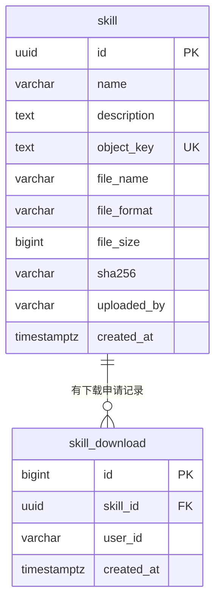
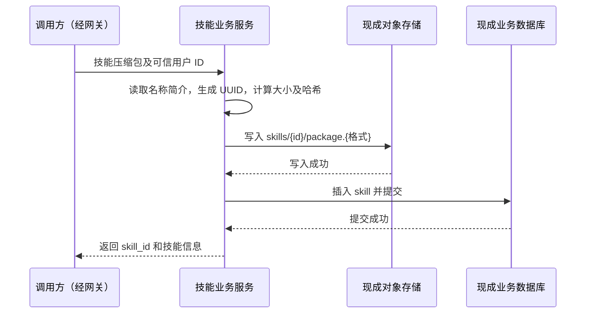

# 技能数据模型（2026-09-17 评审稿）

建议一期只建 **2 张表：`skill` 和 `skill_download`**。一条技能记录对应一个压缩包，包存现成的对象存储，描述信息存业务数据库；下载记录保存技能、用户和时间。以全局 `skill_id` 定位技能，不引入命名空间和版本体系。

本文先确定数据及其关系。后续任务见 [调整任务清单](./09-调整任务清单.md)，对应 PostgreSQL 建表草案见 [schema.sql](./schema.sql)。**这是本次讨论后的设计建议，尚未接入运行代码，也尚未执行数据库迁移。**

## 1. 讨论已确认什么

| 讨论结论 | 对模型的约束 |
|---|---|
| 核心功能是上传、下载、查询、搜索 | 只存支撑这四项功能的数据；查询包括列表及按 ID 取详情 |
| 用户、认证、权限由网关负责 | 不建用户、角色、权限、令牌、租户成员表；业务只接收可信用户标识 |
| 查询和搜索公开；上传、下载需要知道用户身份 | 技能列表不按用户隔离；上传者和下载者分别留痕 |
| 暂不考虑版本迭代 | 不建版本表，不设 `version`、`latest`、`changelog`、版本标签 |
| 原始包存对象存储，描述信息存业务库 | 数据库记对象定位信息，不存压缩包字节，不把 Git 仓库当最终存储 |
| 使用现成数据库及对象存储服务 | 设计业务表和接入逻辑，不建设数据库、OSS、SSO 服务 |
| 先设计模型，再调整其他内容 | 需求、HTTP 接口、模块和后端实现随后按此模型收敛 |

讨论提到了 PG / MySQL，没有最终限定厂商或接入协议。本稿沿用原方案的 **PostgreSQL** 编写 DDL，属于设计建议；若团队实际提供 MySQL，再转换物理类型。对象存储 SDK 与协议按现成服务决定。

## 2. 实际参考了 skill-hub 的什么

参考本地 `skillhub-reference`，提交 `53df1041f5e2f7382a2cd9ea81775c55a81b10d3`。依据是迁移 SQL 和下载代码，不是仅参考接口路径。

| skill-hub 的设计与依据 | 本项目的取舍 |
|---|---|
| [V1](../../skillhub-reference/server/skillhub-app/src/main/resources/db/migration/V1__init_schema.sql) 中 `namespace` 有类型、状态、创建者；`namespace_member` 关联用户及空间角色 | 它是业务空间，不只是 OSS 目录。当前没有空间管理和隔离需求，不建这两张表 |
| [V2](../../skillhub-reference/server/skillhub-app/src/main/resources/db/migration/V2__phase2_skill_tables.sql) 中 `skill` 有独立 ID，`slug` 是空间内的可读名称；原唯一键为 `(namespace_id, slug)` | 我们只用 UUID 标识技能；名称允许重复，不把名称当 ID |
| [V13](../../skillhub-reference/server/skillhub-app/src/main/resources/db/migration/V13__skill_owner_uniqueness.sql) 又将唯一键改成 `(namespace_id, slug, owner_id)` | 参考项目还考虑了所有者隔离，不能把 `ns/slug` 直接理解成适合我们的唯一标识 |
| V2 拆出 `skill_version`、`skill_file`、指向版本的 `skill_tag` | 一期只保留完整压缩包，把包的描述字段合入 `skill`；不做版本和逐文件预览。这里的 `skill_tag` 是版本别名，不是分类标签 |
| V2 的 `skill_search_document` 冗余技能、空间、所有者及可见性 | 先直接搜 `skill.name`、`skill.description`，不建第二份搜索数据 |
| [下载服务](../../skillhub-reference/server/skillhub-domain/src/main/java/com/iflytek/skillhub/domain/skill/service/SkillDownloadService.java) 的包路径为 `packages/{skillId}/{versionId}/bundle.zip`，单文件也有 `storage_key` | 借用“业务记录关联对象”的思路；我们的对象键使用技能 ID，不需要空间或版本前缀 |

**`id` 用来定位记录，`name` 用来描述技能，`object_key` 用来定位压缩包。三者各有用途，不互相替代。** 用户 ID 仅记录操作人，不组成技能坐标，也不等于租户 ID。

## 3. 两张表的关系

数据库外还有一个关系：`skill.object_key` 指向配置好的 bucket 中的一个对象。bucket / endpoint 属于服务配置，不为每条技能重复存储。数据库外键不能校验 OSS 对象是否存在，需要上传流程保证。

### 3.1 `skill`：一个已成功入库的技能包

| 字段 | PostgreSQL 类型 | 必填 | 含义 / 来源 |
|---|---|---|---|
| `id` | `uuid` | 是 | 后端在上传时生成 UUID，同时用于接口定位和对象键 |
| `name` | `varchar(256)` | 是 | 技能名称，建议从 `SKILL.md` 的 `name` 读取；不要求全局唯一 |
| `description` | `text` | 是 | 技能简介，建议从 `SKILL.md` 的 `description` 读取；用于展示和搜索 |
| `object_key` | `text` | 是 | 完整压缩包在配置 bucket 内的键；唯一，不存临时下载 URL |
| `file_name` | `varchar(255)` | 是 | 去除路径后的原始文件名，用于下载文件名；不用于拼接对象键 |
| `file_format` | `varchar(16)` | 是 | `zip` / `tar.gz`；后端识别并校验，不只相信文件扩展名 |
| `file_size` | `bigint` | 是 | **存入 OSS 的压缩包**字节数，不是解压后总大小 |
| `sha256` | `varchar(64)` | 是 | 后端对存储包字节计算的 SHA-256，小写十六进制，不带 `sha256:` 前缀 |
| `uploaded_by` | `varchar(128)` | 是 | 网关传递的用户 ID；只记录上传者，不建用户外键 |
| `created_at` | `timestamptz` | 是 | 记录创建时间，默认 `now()` |

对象键示例：`skills/550e8400-e29b-41d4-a716-446655440000/package.zip`。每个 ID 对应独立对象，不用文件名、用户名或技能名称作存储隔离依据。

暂不存 `updated_at`、状态枚举、分类、标签、正文、frontmatter JSON、文件清单、下载计数和展示装饰字段：本期没有更新、审核、分类筛选、正文检索和逐文件预览的已确认需求。压缩包仍完整保留 `SKILL.md` 及附属文件；以后需要提取字段时有原始数据可用。

### 3.2 `skill_download`：一次已受理的下载申请

| 字段 | PostgreSQL 类型 | 必填 | 含义 / 来源 |
|---|---|---|---|
| `id` | `bigint generated always as identity` | 是 | 下载记录主键 |
| `skill_id` | `uuid` | 是 | 外键指向 `skill.id` |
| `user_id` | `varchar(128)` | 是 | 网关传递的下载用户 ID，不建用户外键 |
| `created_at` | `timestamptz` | 是 | 下载申请受理时间，默认 `now()` |

同一用户多次申请下载会产生多条记录，不设 `(skill_id, user_id)` 唯一约束。记录由下载接口内部写入，本期不新增下载记录查询或统计接口。

若采用临时地址下载，这条记录表示“已生成下载地址并完成受理记录”，**不能表示 OSS 文件已传输完成，更不能表示已安装**。网络中断、用户未点击、同一地址被重复使用，都无法仅凭该表判断。需要实际传输数据时，另接对象存储访问日志。

## 4. 需要说清楚的行为

| 场景 | 本稿建议 |
|---|---|
| 两个用户上传同名技能 | 两条记录、两个 UUID；列表返回 ID，下载按 ID 找包 |
| 同一用户再次上传同名技能 | 仍创建新记录；本期不做覆盖或版本升级，不隐式替换原技能 |
| 两个包哈希相同 | 允许分别存储和登记；`sha256` 不唯一，不做内容去重体系 |
| 上传响应丢失后重试 | 可能形成重复记录；当前不承诺请求幂等。若要求重试不重复，应在接口定稿时增加请求幂等方案，不能拿“同名”或“同哈希”冒充同一次请求 |
| 包内已有 `version` 等扩展字段 | 原样留在压缩包内，本期不用于路由、唯一性或选择下载内容 |
| 修改、删除、下架技能 | 未纳入四项基础功能，本稿不新增接口和状态机；未来明确需求后再补 |
| 身份传递 | 上传、下载使用网关校验后传递的用户 ID；具体头名或上下文格式随网关联调确定，不信任客户端自报身份 |

后端检查用户 ID 是否缺失属于业务入参检查，不实现登录、验签、角色或权限判断。网关需保证身份字段可信，覆盖客户端伪造值，且业务入口不能绕过网关；不复用旧版服务密钥作为新方案的用户身份。

列表、详情、搜索返回业务描述和技能 ID；`object_key`、上传者 ID、下载记录不随公共接口返回。文件本体通过下载流程取得，公开元数据不等于开放 OSS 原始访问地址。

## 5. 四项功能如何读写数据

| 功能 | 数据库操作 | 对象存储操作 |
|---|---|---|
| 上传 | 插入一条 `skill` | 保存一个完整压缩包 |
| 列表 / 详情 | 分页读 `skill` / 按 ID 读一条 | 无 |
| 搜索 | 在 `name`、`description` 中匹配关键词，再分页 | 无 |
| 下载 | 按 ID 读 `skill`，插入一条 `skill_download` | 按 `object_key` 生成下载地址或读取包 |

**上传建议先采用普通表单上传**，由后端接收包、读取名称简介、计算文件属性并写入现成对象存储。分片上传和客户端直传暂不设计。如果以后改直传，必须等后端确认对象及描述信息有效后才插入技能记录，不能一领上传地址就对外展示技能。

一致性处理保持简单，但不能省略：

- 包校验失败或对象写入失败：不插入技能记录。
- 对象已写入、数据库**明确回滚**：尝试删除本次 UUID 的对象；清理失败记录对象键，交人工或现成运维流程处理，不为此先建设调度平台。
- 数据库提交结果不明，例如提交时断线：恢复后确认该事务已经结束，再按本次 UUID 查询主库；确认没有记录才能清理，不能仅凭超时或从库暂时查不到就删对象。
- 数据库提交后才对查询可见。临时文件只在单次上传内使用，长期数据只依赖共享数据库和 OSS。

下载建议采用“查技能 → 确认对象存在 → 生成临时 URL → 写入下载记录 → 返回 URL”。签名成功本身不代表对象存在。任一步失败不返回成功；技能不存在或对象已丢失时返回明确错误。下载记录写入失败也不发放 URL。临时地址有效期由接口阶段确定，不存入技能表。

### 查询、搜索和索引

- 列表按 `created_at DESC, id DESC` 稳定排序并分页，ID 用于相同时间的排序。
- 搜索第一版只做名称和简介的关键词包含匹配；PostgreSQL 使用参数化 `ILIKE`，将通配符和转义字符按普通文本处理。空关键词走列表，结果使用同一分页及排序规则。
- 不承诺分词、相关度、正文检索、分面、高亮或指定延迟。包含匹配可能扫描全表，普通 B-tree 不能加速 `%关键词%`；联调时用真实量级数据测量，达到瓶颈再评估数据库可用的文本索引。
- 索引仅有技能主键、对象键唯一索引、技能时间排序索引，以及下载记录主键和 `(skill_id, created_at DESC)` 索引；后者也覆盖外键查询。没有“我的上传 / 下载”需求，暂不加用户索引。

## 6. 与现有数据如何衔接

现有运行代码仍是 SQLite + Git 同步；旧 `docs/schema.sql` 的 13 表方案没有接入这些代码。此次替换该 SQL 文件是更新设计稿，**不代表已把 SQLite 转成 PostgreSQL**。

| 现有数据 / 行为 | 后续处理 |
|---|---|
| SQLite 的文本 `skill.id` | 当前是目录标识，不当作新 UUID 复用；导入工具保存旧 ID → 新 UUID 映射供核对或适配 |
| `name`、`description` | 从实际导入包提取并与旧记录核对；缺失数据列入问题清单，不伪造内容 |
| `content_hash` | 是现有内容索引使用的哈希，不直接当作压缩包 SHA-256；对实际上传包重新计算 |
| 本地技能 tar.gz | 如需保留存量，作为一次性导入输入，写 OSS 后再写业务表 |
| 存量上传者未知 | 由团队提供统一的迁移操作人 ID，不虚构原作者，也不据 Git 提交者推断用户身份 |
| `user_install`、`skill_stat` | 安装不等于下载，不转写为 `skill_download`；原数据先保留归档 |
| preset、pack、星图及展示字段 | 不进入本期核心模型；旧接口及页面的去留单独盘点后处理 |
| Git 定时同步 | 新链路改为上传驱动；不能再让同步任务覆盖或删除已上传技能 |

`schema.sql` 是空 PostgreSQL schema 的初始化草案，包含建表和索引，不包含旧库删表或数据搬迁操作。真正的升级需要独立导入工具和核对结果。

## 7. 模型评审重点

上述功能边界来自讨论，下列三项是本稿的建议，需要在接口定稿时核对业务是否接受：

1. **不建空间，按 UUID 定位，同名允许重复，每次上传创建独立记录。** 是否确实暂不需要“更新同一个技能”？
2. **只搜索名称和简介。** 是否足够支撑当前搜索，而无需正文、分类及标签筛选？
3. **身份与存储接入条件。** 网关提供哪个全局用户 ID；现成数据库是否为 PG；对象存储提供什么访问方式？这些决定接入配置，不引出自建用户或基础设施模块。

其余需求明确后再增加对应字段和表，不为尚未确认的功能先预留一整套结构。
